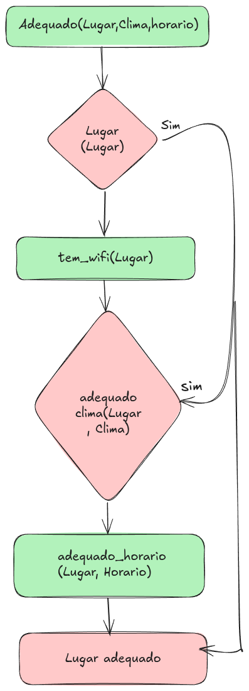

Certainly, senhor Michel. Below is the full translation of your project documentation into English:

---

# Intelligent Agent for Location Selection

This project implements an intelligent agent that assists in choosing the most suitable location for activities, considering characteristics such as weather, time, and environment. It uses the Python programming language and the Prolog logic system for rule inference.

## 🛠️ Technologies Used

* **Python**: Main programming language.
* **PySwip**: Python library for SWI-Prolog.
* **SWI-Prolog**: Logic system used for rule inference.

## 📦 Prerequisites

Before running the project, you need to:

1. **Install SWI-Prolog**: Download and install SWI-Prolog from the [official website](https://www.swi-prolog.org/Download.html).

2. **Install Python 3.8 or higher**: Ensure Python is installed on your machine. You can verify this by running `python --version` or `python3 --version` in the terminal.

3. **Install `pip`**: `pip` is Python’s package manager. If you don’t have it installed, follow the instructions at [https://pip.pypa.io/en/stable/installation/](https://pip.pypa.io/en/stable/installation/).

## 🚀 How to Run the Project

Follow the steps below to set up and run the project:

### 1. Clone the repository

```bash
git clone https://github.com/michelfviana/trabalho_agente_inteligente.git
cd trabalho_agente_inteligente
```

### 2. Create and activate a virtual environment

#### On Windows 11 (PowerShell)

```bash
python -m venv .venv
.\.venv\Scripts\Activate.ps1
```

#### On Linux/macOS

```bash
python3 -m venv .venv
source .venv/bin/activate
```

*Note:* The use of virtual environments is recommended to isolate project dependencies.

### 3. Install the dependencies

If you don’t already have a `requirements.txt` file, you can generate one with the following command:

```bash
pip freeze > requirements.txt
```

Then, install the dependencies:

```bash
pip install -r requirements.txt
```

### 4. Ensure the `regras.pl` file is present

This file contains the necessary Prolog rules for the agent's functionality.

### 5. Run the Python script

```bash
python agente.py
```

The agent will query the appropriate locations based on the weather and time defined in the code.

## 📄 Project Structure

* `agente.py`: Main script containing the implementation of the intelligent agent.
* `regras.pl`: Prolog file containing inference rules and facts about locations.
* `requirements.txt`: File listing the project's dependencies.
* `README.md`: This file, containing information about the project and how to use it.

<div align="center">
  <h3>Intelligent Agent Operation Flowchart</h3>
  
  <p>Figure 1: Representation of the intelligent agent's operation flow.</p>
</div>

---

Caso deseje, posso também auxiliá-lo na conversão para um `README.md` em inglês ou revisar o conteúdo em termos de clareza e estrutura.
